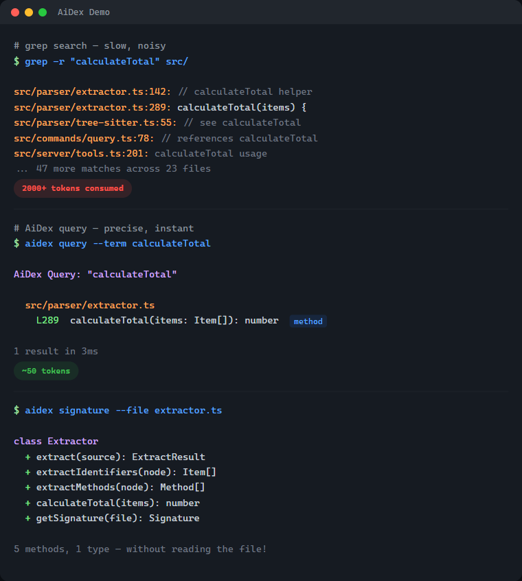
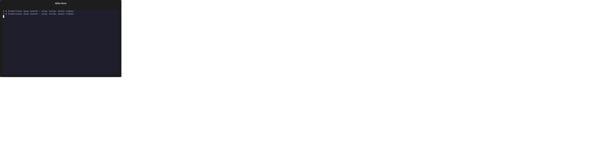
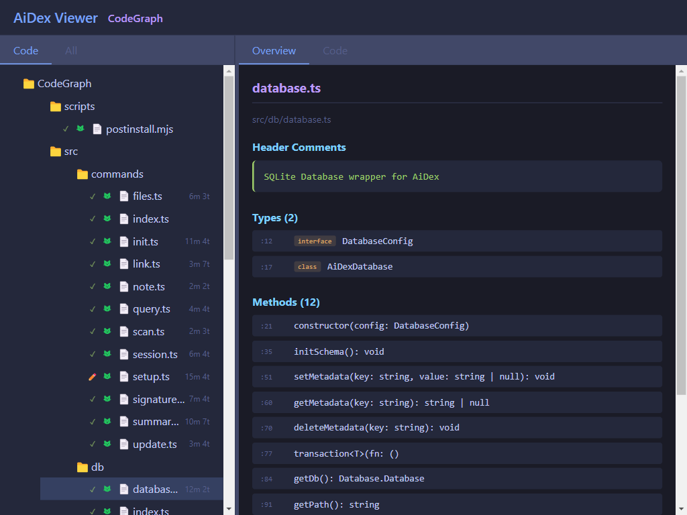
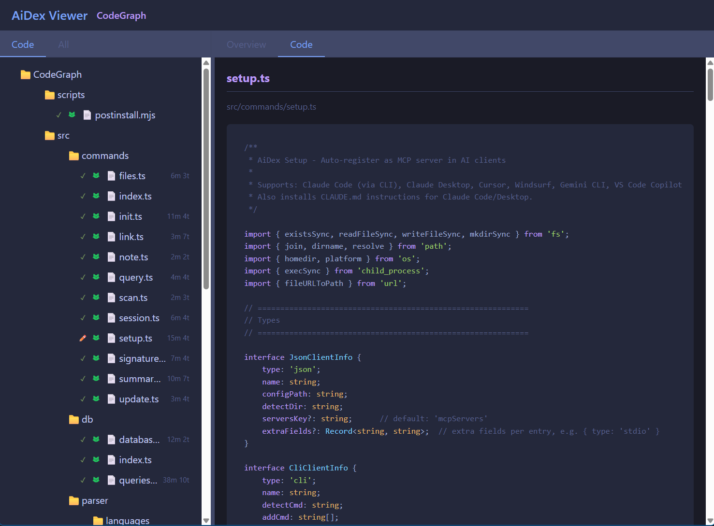

# AiDex

[](https://www.npmjs.com/package/aidex-mcp)
[](LICENSE)
[](https://nodejs.org/)
[](https://modelcontextprotocol.io/)

**Stop wasting 80% of your AI's context window on code searches.**

AiDex is an MCP server that gives AI coding assistants instant access to your entire codebase through a persistent, pre-built index. Works with any MCP-compatible AI assistant: Claude Code, Claude Desktop, Cursor, Windsurf, Gemini CLI, VS Code Copilot, and more.



<details>
<summary>Animated version</summary>



</details>

### What's Inside — 27 Tools in One Server

| Category | Tools | What it does |
|----------|-------|--------------|
| **Search & Index** | `init`, `query`, `update`, `remove`, `status` | Index your project, search identifiers by name (exact/contains/starts_with), time-based filtering |
| **Signatures** | `signature`, `signatures` | Get classes + methods of any file without reading it — single file or glob pattern |
| **Project Overview** | `summary`, `tree`, `describe`, `files` | Entry points, language breakdown, file tree with stats, file listing by type |
| **Cross-Project** | `link`, `unlink`, `links`, `scan` | Link dependencies, discover indexed projects |
| **Global Search** | `global_init`, `global_query`, `global_signatures`, `global_status`, `global_refresh` | Search across ALL your projects at once — "Have I ever written X?" |
| **Sessions** | `session`, `note` | Track sessions, detect external changes, leave notes for next session (with searchable history) |
| **Task Backlog** | `task`, `tasks` | Built-in task management with priorities, tags, and auto-logged history |
| **Screenshots** | `screenshot`, `windows` | Cross-platform screen capture with LLM optimization — scale + color reduction saves up to 95% tokens |
| **Viewer** | `viewer` | Interactive browser UI with file tree, signatures, tasks, and live reload |

**11 languages** — C#, TypeScript, JavaScript, Rust, Python, C, C++, Java, Go, PHP, Ruby

<details>
<summary><strong>Quick Examples</strong> — see it in action</summary>

```
# Find where "PlayerHealth" is defined — 1 call, ~50 tokens
aidex_query({ term: "PlayerHealth" })
→ Engine.cs:45, Player.cs:23, UI.cs:156

# All methods in a file — without reading the whole file
aidex_signature({ file: "src/Engine.cs" })
→ class GameEngine { Update(), Render(), LoadScene(), ... }

# What changed in the last 2 hours?
aidex_query({ term: "render", modified_since: "2h" })

# Search across ALL your projects at once
aidex_global_query({ term: "TransparentWindow", mode: "contains" })
→ Found in: LibWebAppGpu (3 hits), DebugViewer (1 hit)

# Leave a note for your next session
aidex_note({ path: ".", note: "Test the parser fix after restart" })

# Create a task while working
aidex_task({ path: ".", action: "create", title: "Fix edge case in parser", priority: 1, tags: "bug" })
```

</details>

## Table of Contents

- [What's Inside](#whats-inside--27-tools-in-one-server)
- [The Problem](#the-problem)
- [The Solution](#the-solution)
- [Why Not Just Grep?](#why-not-just-grep)
- [How It Works](#how-it-works)
- [Features](#features)
- [Supported Languages](#supported-languages)
- [Quick Start](#quick-start)
- [Available Tools](#available-tools)
- [Time-based Filtering](#time-based-filtering)
- [Project Structure](#project-structure)
- [Session Notes](#session-notes)
- [Task Backlog](#task-backlog)
- [Global Search](#global-search)
- [Screenshots — LLM-Optimized](#screenshots--llm-optimized)
- [Interactive Viewer](#interactive-viewer)
- [CLI Usage](#cli-usage)
- [Performance](#performance)
- [Technology](#technology)
- [Contributing](#contributing)
- [License](#license)

## The Problem

Every time your AI assistant searches for code, it:
- **Greps** through thousands of files → hundreds of results flood the context
- **Reads** file after file to understand the structure → more context consumed
- **Forgets** everything when the session ends → repeat from scratch

A single "Where is X defined?" question can eat 2,000+ tokens. Do that 10 times and you've burned half your context on navigation alone.

## The Solution

Index once, query forever:

```
# Before: grep flooding your context
AI: grep "PlayerHealth" → 200 hits in 40 files
AI: read File1.cs, File2.cs, File3.cs...
→ 2000+ tokens consumed, 5+ tool calls

# After: precise results, minimal context
AI: aidex_query({ term: "PlayerHealth" })
→ Engine.cs:45, Player.cs:23, UI.cs:156
→ ~50 tokens, 1 tool call
```

**Result: 50-80% less context used for code navigation.**

## Why Not Just Grep?

| | Grep/Ripgrep | AiDex |
|---|---|---|
| **Context usage** | 2000+ tokens per search | ~50 tokens |
| **Results** | All text matches | Only identifiers |
| **Precision** | `log` matches `catalog`, `logarithm` | `log` finds only `log` |
| **Persistence** | Starts fresh every time | Index survives sessions |
| **Structure** | Flat text search | Knows methods, classes, types |

**The real cost of grep**: Every grep result includes surrounding context. Search for `User` in a large project and you'll get hundreds of hits - comments, strings, partial matches. Your AI reads through all of them, burning context tokens on noise.

**AiDex indexes identifiers**: It uses Tree-sitter to actually parse your code. When you search for `User`, you get the class definition, the method parameters, the variable declarations - not every comment that mentions "user".

## How It Works

1. **Index your project once** (~1 second per 1000 files)
   ```
   aidex_init({ path: "/path/to/project" })
   ```

2. **AI searches the index instead of grepping**
   ```
   aidex_query({ term: "Calculate", mode: "starts_with" })
   → All functions starting with "Calculate" + exact line numbers

   aidex_query({ term: "Player", modified_since: "2h" })
   → Only matches changed in the last 2 hours
   ```

3. **Get file overviews without reading entire files**
   ```
   aidex_signature({ file: "src/Engine.cs" })
   → All classes, methods, and their signatures
   ```

The index lives in `.aidex/index.db` (SQLite) - fast, portable, no external dependencies.

## Features

- **Tree-sitter Parsing**: Real code parsing, not regex — indexes identifiers, ignores keywords and noise
- **~50 Tokens per Search**: vs 2000+ with grep — your AI keeps its context for actual work
- **Persistent Index**: Survives between sessions — no re-scanning, no re-reading
- **Incremental Updates**: Re-index single files after changes, not the whole project
- **Time-based Filtering**: Find what changed in the last hour, day, or week
- **Auto-Cleanup**: Excluded files (e.g., build outputs) are automatically removed from index
- **Zero Dependencies**: SQLite with WAL mode — single file, fast, portable

## Supported Languages

| Language | Extensions |
|----------|------------|
| C# | `.cs` |
| TypeScript | `.ts`, `.tsx` |
| JavaScript | `.js`, `.jsx`, `.mjs`, `.cjs` |
| Rust | `.rs` |
| Python | `.py`, `.pyw` |
| C | `.c`, `.h` |
| C++ | `.cpp`, `.cc`, `.cxx`, `.hpp`, `.hxx` |
| Java | `.java` |
| Go | `.go` |
| PHP | `.php` |
| Ruby | `.rb`, `.rake` |

## Quick Start

### 1. Install

```bash
npm install -g aidex-mcp
```

**That's it.** Setup runs automatically after install — it detects your installed AI clients (Claude Code, Claude Desktop, Cursor, Windsurf, Gemini CLI, VS Code Copilot) and registers AiDex as an MCP server. It also adds usage instructions to your AI's config (`~/.claude/CLAUDE.md`, `~/.gemini/GEMINI.md`).

To re-run setup manually: `aidex setup` | To unregister: `aidex unsetup` | To skip auto-setup: `AIDEX_NO_SETUP=1 npm install -g aidex-mcp`

### 2. Or register manually with your AI assistant

**For Claude Code** (`~/.claude/settings.json` or `~/.claude.json`):
```json
{
  "mcpServers": {
    "aidex": {
      "type": "stdio",
      "command": "aidex",
      "env": {}
    }
  }
}
```

**For Claude Desktop** (`%APPDATA%/Claude/claude_desktop_config.json` on Windows):
```json
{
  "mcpServers": {
    "aidex": {
      "command": "aidex"
    }
  }
}
```

> **Note:** Both `aidex` and `aidex-mcp` work as command names.

> **Important:** The server name in your config determines the MCP tool prefix. Use `"aidex"` as shown above — this gives you tool names like `aidex_query`, `aidex_signature`, etc. Using a different name (e.g., `"codegraph"`) would change the prefix accordingly.

**For Gemini CLI** (`~/.gemini/settings.json`):
```json
{
  "mcpServers": {
    "aidex": {
      "command": "aidex"
    }
  }
}
```

**For VS Code Copilot** (run `MCP: Open User Configuration` in Command Palette):
```json
{
  "servers": {
    "aidex": {
      "type": "stdio",
      "command": "aidex"
    }
  }
}
```

**For other MCP clients**: See your client's documentation for MCP server configuration.

### 3. Make your AI actually use it

Add to your AI's instructions (e.g., `~/.claude/CLAUDE.md` for Claude Code, or the equivalent for your AI client). This tells the AI **when and how** to use AiDex instead of grepping:

```markdown
## AiDex - Persistent Code Index (MCP Server)

AiDex provides fast, precise code search through a pre-built index.
**Always prefer AiDex over Grep/Glob for code searches.**

### REQUIRED: Before using Grep/Glob/Read for code searches

```
Do I want to search code?
├── .aidex/ exists    → STOP! Use AiDex instead
├── .aidex/ missing   → run aidex_init (don't ask), THEN use AiDex
└── Config/Logs/Text  → Grep/Read is fine
```

**NEVER do this when .aidex/ exists:**
- ❌ `Grep pattern="functionName"` → ✅ `aidex_query term="functionName"`
- ❌ `Grep pattern="class.*Name"` → ✅ `aidex_query term="Name" mode="contains"`
- ❌ `Read file.cs` to see methods → ✅ `aidex_signature file="file.cs"`
- ❌ `Glob pattern="**/*.cs"` + Read → ✅ `aidex_signatures pattern="**/*.cs"`

### Session-Start Rule (REQUIRED — every session, no exceptions)

1. Call `aidex_session({ path: "<project>" })` — detects external changes, auto-reindexes
2. If `.aidex/` does NOT exist → run `aidex_init` automatically (don't ask)
3. If a session note exists → **show it to the user** before continuing
4. **Before ending a session:** always leave a note about what to do next

### Question → Right Tool

| Question | Tool |
|----------|------|
| "Where is X defined?" | `aidex_query term="X"` |
| "Find anything containing X" | `aidex_query term="X" mode="contains"` |
| "All functions starting with X" | `aidex_query term="X" mode="starts_with"` |
| "What methods does file Y have?" | `aidex_signature file="Y"` |
| "Explore all files in src/" | `aidex_signatures pattern="src/**"` |
| "Project overview" | `aidex_summary` + `aidex_tree` |
| "What changed recently?" | `aidex_query term="X" modified_since="2h"` |
| "What files changed today?" | `aidex_files path="." modified_since="8h"` |
| "Have I ever written X?" | `aidex_global_query term="X" mode="contains"` |
| "Which project has class Y?" | `aidex_global_signatures term="Y" kind="class"` |
| "All indexed projects?" | `aidex_global_status` |

### Search Modes

- **`exact`** (default): Finds only the exact identifier — `log` won't match `catalog`
- **`contains`**: Finds identifiers containing the term — `render` matches `preRenderSetup`
- **`starts_with`**: Finds identifiers starting with the term — `Update` matches `UpdatePlayer`, `UpdateUI`

### All Tools (27)

| Category | Tools | Purpose |
|----------|-------|---------|
| Search & Index | `aidex_init`, `aidex_query`, `aidex_update`, `aidex_remove`, `aidex_status` | Index project, search identifiers (exact/contains/starts_with), time filter |
| Signatures | `aidex_signature`, `aidex_signatures` | Get classes + methods without reading files |
| Overview | `aidex_summary`, `aidex_tree`, `aidex_describe`, `aidex_files` | Entry points, file tree, file listing by type |
| Cross-Project | `aidex_link`, `aidex_unlink`, `aidex_links`, `aidex_scan` | Link dependencies, discover projects |
| Global Search | `aidex_global_init`, `aidex_global_query`, `aidex_global_signatures`, `aidex_global_status`, `aidex_global_refresh` | Search across ALL projects |
| Sessions | `aidex_session`, `aidex_note` | Track sessions, leave notes (with searchable history) |
| Tasks | `aidex_task`, `aidex_tasks` | Built-in backlog with priorities, tags, auto-logged history |
| Screenshots | `aidex_screenshot`, `aidex_windows` | Screen capture with LLM optimization (scale + color reduction, no index needed) |
| Viewer | `aidex_viewer` | Interactive browser UI with file tree, signatures, tasks |

**11 languages:** C#, TypeScript, JavaScript, Rust, Python, C, C++, Java, Go, PHP, Ruby

### Session Notes

Leave notes for the next session — they persist in the database:
```
aidex_note({ path: ".", note: "Test the fix after restart" })        # Write
aidex_note({ path: ".", note: "Also check edge cases", append: true }) # Append
aidex_note({ path: "." })                                              # Read
aidex_note({ path: ".", search: "parser" })                            # Search history
aidex_note({ path: ".", clear: true })                                 # Clear
```
- **Before ending a session:** automatically leave a note about next steps
- **User says "remember for next session: ..."** → write it immediately

### Task Backlog

Track TODOs, bugs, and features right next to your code index:
```
aidex_task({ path: ".", action: "create", title: "Fix bug", priority: 1, tags: "bug" })
aidex_task({ path: ".", action: "update", id: 1, status: "done" })
aidex_task({ path: ".", action: "log", id: 1, note: "Root cause found" })
aidex_tasks({ path: ".", status: "active" })
```
Priority: 1=high, 2=medium, 3=low | Status: `backlog → active → done | cancelled`

### Global Search (across all projects)

```
aidex_global_init({ path: "/path/to/all/repos" })                     # Scan & register
aidex_global_init({ path: "...", index_unindexed: true })              # + auto-index small projects
aidex_global_query({ term: "TransparentWindow", mode: "contains" })   # Search everywhere
aidex_global_signatures({ term: "Render", kind: "method" })           # Find methods everywhere
aidex_global_status({ sort: "recent" })                                # List all projects
```

### Screenshots

```
aidex_screenshot()                                             # Full screen
aidex_screenshot({ mode: "active_window" })                    # Active window
aidex_screenshot({ mode: "window", window_title: "VS Code" }) # Specific window
aidex_screenshot({ scale: 0.5, colors: 2 })                   # B&W, half size (ideal for LLM)
aidex_screenshot({ colors: 16 })                               # 16 colors (UI readable)
aidex_windows({ filter: "chrome" })                            # Find window titles
```
No index needed. Returns file path → use `Read` to view immediately.

**LLM optimization strategy:** Always start with aggressive settings, then retry if unreadable:
1. First try: `scale: 0.5, colors: 2` (B&W, half size — smallest possible)
2. If unreadable: retry with `colors: 16` (adds shading for UI elements)
3. If still unclear: `scale: 0.75` or omit `colors` for full quality
4. **Remember** what works for each window/app during the session — don't retry every time.
```

### 4. Index your project

Ask your AI: *"Index this project with AiDex"*

Or manually in the AI chat:
```
aidex_init({ path: "/path/to/your/project" })
```

## Available Tools

| Tool | Description |
|------|-------------|
| `aidex_init` | Index a project (creates `.aidex/`) |
| `aidex_query` | Search by term (exact/contains/starts_with) |
| `aidex_signature` | Get one file's classes + methods |
| `aidex_signatures` | Get signatures for multiple files (glob) |
| `aidex_update` | Re-index a single changed file |
| `aidex_remove` | Remove a deleted file from index |
| `aidex_summary` | Project overview |
| `aidex_tree` | File tree with statistics |
| `aidex_describe` | Add documentation to summary |
| `aidex_link` | Link another indexed project |
| `aidex_unlink` | Remove linked project |
| `aidex_links` | List linked projects |
| `aidex_status` | Index statistics |
| `aidex_scan` | Find indexed projects in directory tree |
| `aidex_files` | List project files by type (code/config/doc/asset) |
| `aidex_note` | Read/write session notes (persists between sessions) |
| `aidex_session` | Start session, detect external changes, auto-reindex |
| `aidex_viewer` | Open interactive project tree in browser |
| `aidex_task` | Create, read, update, delete tasks with priority and tags |
| `aidex_tasks` | List and filter tasks by status, priority, or tag |
| `aidex_screenshot` | Take a screenshot (fullscreen, window, region) with optional scale + color reduction |
| `aidex_windows` | List open windows for screenshot targeting |
| `aidex_global_init` | Scan directory tree, register all indexed projects in global DB |
| `aidex_global_status` | List all registered projects with stats |
| `aidex_global_query` | Search terms across ALL registered projects |
| `aidex_global_signatures` | Search methods/types by name across all projects |
| `aidex_global_refresh` | Update stats and remove stale projects from global DB |

## Time-based Filtering

Track what changed recently with `modified_since` and `modified_before`:

```
aidex_query({ term: "render", modified_since: "2h" })   # Last 2 hours
aidex_query({ term: "User", modified_since: "1d" })     # Last day
aidex_query({ term: "API", modified_since: "1w" })      # Last week
```

Supported formats:
- **Relative**: `30m` (minutes), `2h` (hours), `1d` (days), `1w` (weeks)
- **ISO date**: `2026-01-27` or `2026-01-27T14:30:00`

Perfect for questions like *"What did I change in the last hour?"*

## Project Structure

AiDex indexes ALL files in your project (not just code), letting you query the structure:

```
aidex_files({ path: ".", type: "config" })  # All config files
aidex_files({ path: ".", type: "test" })    # All test files
aidex_files({ path: ".", pattern: "**/*.md" })  # All markdown files
aidex_files({ path: ".", modified_since: "30m" })  # Changed this session
```

File types: `code`, `config`, `doc`, `asset`, `test`, `other`, `dir`

Use `modified_since` to find files changed in this session - perfect for *"What did I edit?"*

## Session Notes

Leave reminders for the next session - no more losing context between chats:

```
aidex_note({ path: ".", note: "Test the glob fix after restart" })  # Write
aidex_note({ path: ".", note: "Also check edge cases", append: true })  # Append
aidex_note({ path: "." })                                              # Read
aidex_note({ path: ".", clear: true })                                 # Clear
```

**Note History** (v1.10): Old notes are automatically archived when overwritten or cleared. Browse and search past notes:

```
aidex_note({ path: ".", history: true })                    # Browse archived notes
aidex_note({ path: ".", search: "parser" })                 # Search note history
aidex_note({ path: ".", history: true, limit: 5 })          # Last 5 archived notes
```

**Use cases:**
- Before ending a session: *"Remember to test X next time"*
- AI auto-reminder: Save what to verify after a restart
- Handover notes: Context for the next session without editing config files
- Search past sessions: *"What did we do about the parser?"*

Notes are stored in the SQLite database (`.aidex/index.db`) and persist indefinitely.

## Task Backlog

Keep your project tasks right next to your code index - no Jira, no Trello, no context switching:

```
aidex_task({ path: ".", action: "create", title: "Fix parser bug", priority: 1, tags: "bug" })
aidex_task({ path: ".", action: "update", id: 1, status: "done" })
aidex_task({ path: ".", action: "log", id: 1, note: "Root cause: unbounded buffer" })
aidex_tasks({ path: ".", status: "active" })
```

**Features:**
- **Priorities**: 🔴 high, 🟡 medium, ⚪ low
- **Statuses**: `backlog → active → done | cancelled`
- **Tags**: Categorize tasks (`bug`, `feature`, `docs`, etc.)
- **History log**: Every status change is auto-logged, plus manual notes
- **Viewer integration**: Tasks tab in the browser viewer with live updates
- **Persistent**: Tasks survive between sessions, stored in `.aidex/index.db`

Your AI assistant can create tasks while working (*"found a bug in the parser, add it to the backlog"*), track progress, and pick up where you left off next session.

## Global Search

Search across ALL your indexed projects at once. Perfect for *"Have I ever written a transparent window?"* or *"Where did I use that algorithm?"*

### Setup

```
aidex_global_init({ path: "Q:/develop" })                              # Scan & register
aidex_global_init({ path: "Q:/develop", exclude: ["llama.cpp"] })      # Skip external repos
aidex_global_init({ path: "Q:/develop", index_unindexed: true })       # Auto-index all found projects
aidex_global_init({ path: "Q:/develop", index_unindexed: true, show_progress: true })  # With browser progress UI
```

This scans your project directory, registers all AiDex-indexed projects in a global database (`~/.aidex/global.db`), and reports any unindexed projects it finds by detecting project markers (`.csproj`, `package.json`, `Cargo.toml`, etc.).

With `index_unindexed: true`, it also auto-indexes all discovered projects with ≤500 code files. Larger projects are listed separately for user decision. Add `show_progress: true` to open a live progress UI in your browser (`http://localhost:3334`).

### Search

```
aidex_global_query({ term: "TransparentWindow" })                      # Exact match
aidex_global_query({ term: "transparent", mode: "contains" })          # Fuzzy search
aidex_global_signatures({ name: "Render", kind: "method" })            # Find methods
aidex_global_signatures({ name: "Player", kind: "class" })             # Find classes
```

### How it works

- Uses SQLite `ATTACH DATABASE` to query project databases directly — no data copying
- Results are cached in memory (5-minute TTL) for fast repeated queries
- Projects are batched (8 at a time) to respect SQLite's attachment limit
- Each project keeps its own `.aidex/index.db` as the single source of truth
- **Auto-deduplication**: Parent projects that contain sub-projects are automatically skipped (e.g., `MyApp/` is removed when `MyApp/Frontend/` and `MyApp/Backend/` exist as separate indexed projects)

### Management

```
aidex_global_status()                                                  # List all projects
aidex_global_status({ sort: "recent" })                                # Most recently indexed first
aidex_global_refresh()                                                 # Update stats, remove stale
```

## Screenshots — LLM-Optimized

Take screenshots and **reduce them up to 95%** for LLM context. A typical screenshot goes from ~100 KB to ~5 KB — that's thousands of tokens saved per image.

### Why this matters

| | Raw Screenshot | Optimized (scale=0.5, colors=2) |
|---|---|---|
| **File size** | ~100-500 KB | ~5-15 KB |
| **Tokens consumed** | ~5,000-25,000 | ~250-750 |
| **Text readable?** | Yes | Yes |
| **Colors** | 16M (24-bit) | 2 (black & white) |

Most screenshots in AI context are for reading text — error messages, logs, UI labels. You don't need 16 million colors for that.

### Usage

```
aidex_screenshot()                                             # Full screen (full quality)
aidex_screenshot({ mode: "active_window" })                    # Active window
aidex_screenshot({ mode: "window", window_title: "VS Code" }) # Specific window
aidex_screenshot({ scale: 0.5, colors: 2 })                   # B&W, half size (best for text)
aidex_screenshot({ scale: 0.5, colors: 16 })                  # 16 colors (UI readable)
aidex_screenshot({ colors: 256 })                              # 256 colors (good quality)
aidex_screenshot({ mode: "region" })                           # Interactive selection
aidex_screenshot({ mode: "rect", x: 100, y: 200, width: 800, height: 600 })  # Coordinates
aidex_windows({ filter: "chrome" })                            # Find window titles
```

### Optimization parameters

| Parameter | Values | Description |
|-----------|--------|-------------|
| `scale` | 0.1 - 1.0 | Scale factor (0.5 = half resolution). Most HiDPI screens are 2-3x anyway. |
| `colors` | 2, 4, 16, 256 | Color reduction. 2 = black & white, ideal for text screenshots. |

### Recommended strategy for AI assistants

The tool description tells LLMs to optimize automatically:

1. **Start aggressive**: `scale: 0.5, colors: 2` (smallest possible)
2. **If unreadable**: retry with `colors: 16` (adds shading for UI elements)
3. **If still unclear**: try `scale: 0.75` or full color
4. **Remember**: cache what works per window/app for the rest of the session

This way the AI learns the right settings per app without wasting tokens on oversized images.

### Features

- **5 capture modes**: Fullscreen, active window, specific window (by title), interactive region selection, coordinate-based rectangle
- **Cross-platform**: Windows (PowerShell + System.Drawing), macOS (sips + ImageMagick), Linux (ImageMagick)
- **Multi-monitor**: Select which monitor to capture
- **Delay**: Wait N seconds before capturing (e.g., to open a menu first)
- **Size reporting**: Shows original → optimized size and percentage saved
- **Auto-path**: Default saves to temp directory with fixed filename
- **No index required**: Works standalone, no `.aidex/` needed

## Interactive Viewer

Explore your indexed project visually in the browser:

```
aidex_viewer({ path: "." })
```

Opens `http://localhost:3333` with:
- **Interactive file tree** - Click to expand directories
- **File signatures** - Click any file to see its types and methods
- **Live reload** - Changes detected automatically while you code
- **Git status icons** - See which files are modified, staged, or untracked





Close with `aidex_viewer({ path: ".", action: "close" })`

## CLI Usage

```bash
aidex scan Q:/develop       # Find all indexed projects
aidex init ./myproject      # Index a project from command line
```

> `aidex-mcp` works as an alias for `aidex`.

## Performance

| Project | Files | Items | Index Time | Query Time |
|---------|-------|-------|------------|------------|
| Small (AiDex) | 19 | 1,200 | <1s | 1-5ms |
| Medium (RemoteDebug) | 10 | 1,900 | <1s | 1-5ms |
| Large (LibPyramid3D) | 18 | 3,000 | <1s | 1-5ms |
| XL (MeloTTS) | 56 | 4,100 | ~2s | 1-10ms |

## Technology

- **Parser**: [Tree-sitter](https://tree-sitter.github.io/) - Real parsing, not regex
- **Database**: SQLite with WAL mode - Fast, single file, zero config
- **Protocol**: [MCP](https://modelcontextprotocol.io/) - Works with any compatible AI

## Project Structure

```
.aidex/                  ← Created in YOUR project
├── index.db             ← SQLite database
└── summary.md           ← Optional documentation

AiDex/                   ← This repository
├── src/
│   ├── commands/        ← Tool implementations
│   ├── db/              ← SQLite wrapper
│   ├── parser/          ← Tree-sitter integration
│   └── server/          ← MCP protocol handler
└── build/               ← Compiled output
```

## Contributing

PRs welcome! Especially for:
- New language support
- Performance improvements
- Documentation

## License

MIT License - see [LICENSE](LICENSE)

## Authors

Uwe Chalas & Claude
